很多同学对 gpt 登录时弹出的手机号验证摸不着头脑。  

去接码平台，又怕 gpt 二验，完全凉凉。

所以收集了一些中国大陆能买到的可长期保号的手机卡，让 gpt 帮我做成了一张表图。

附图：

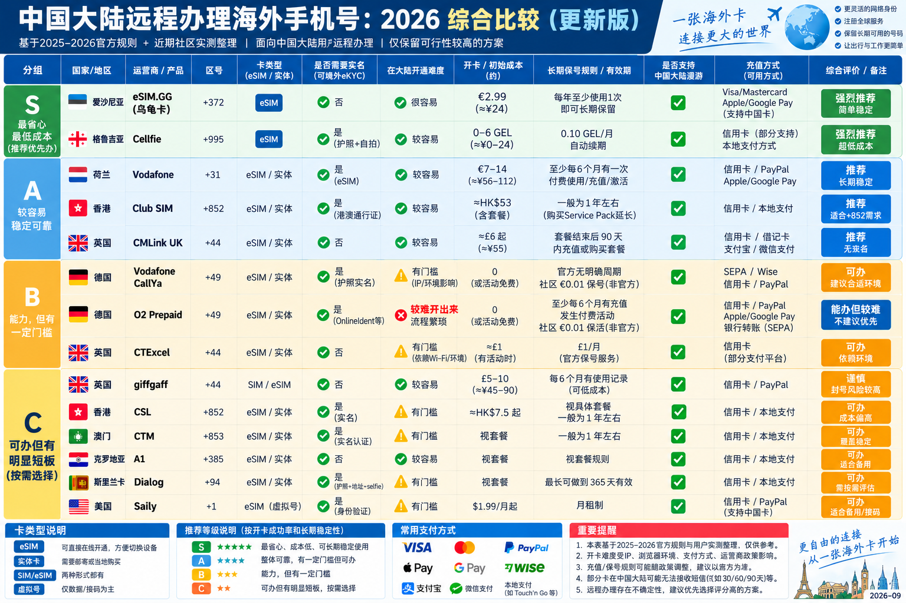

这张表按推荐等级整理了多种海外号码方案，并列出国家/地区、运营商、号码类型、实名要求、办理难度、开卡成本、保号规则、漫游和充值方式。  

eSIM.GG 爱沙尼亚号码被列在第一档，主打成本较低、办理简单，保号十分懒人。  

下面就以它为例介绍购买和安装流程。

## 购买号码

1. 打开 [eSIM.gg](https://esim.gg)，点击“立即开始”，用邮箱注册并登录。

   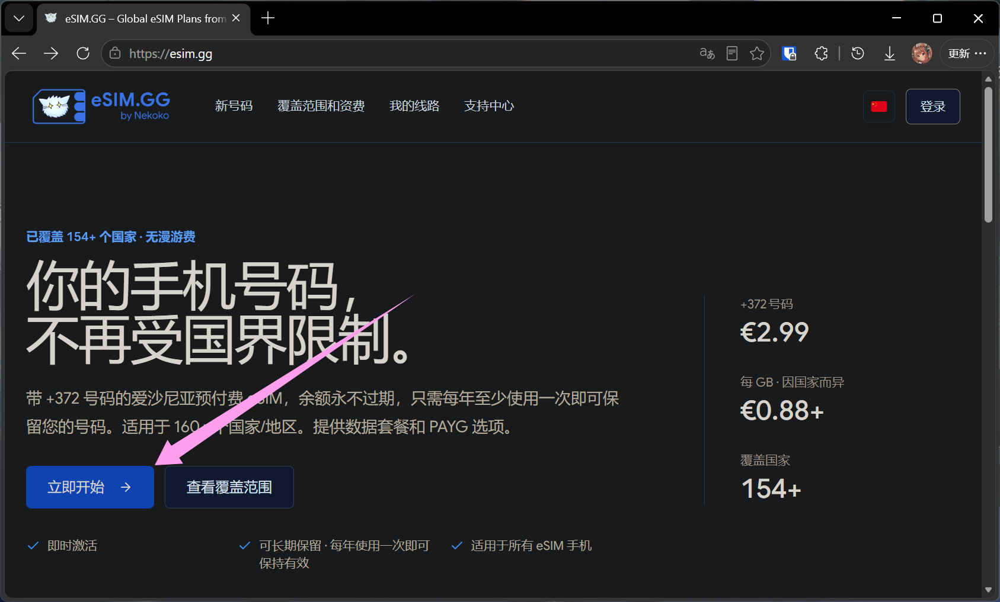

   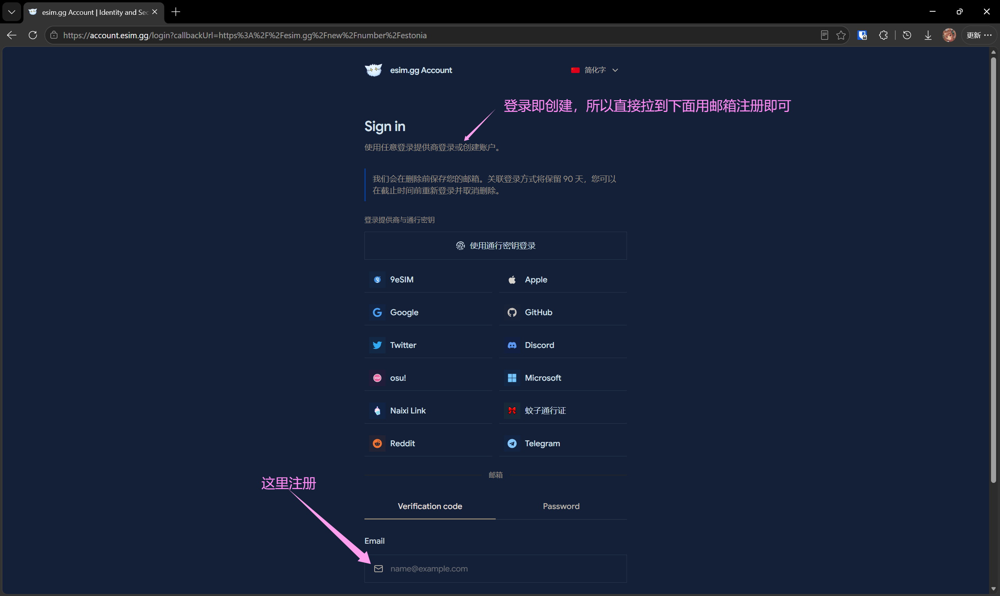

2. 阅读并勾选购买须知。购买爱沙尼亚号码需要至少预存 **€1**，把金额滑到最低后点“下一步”。

   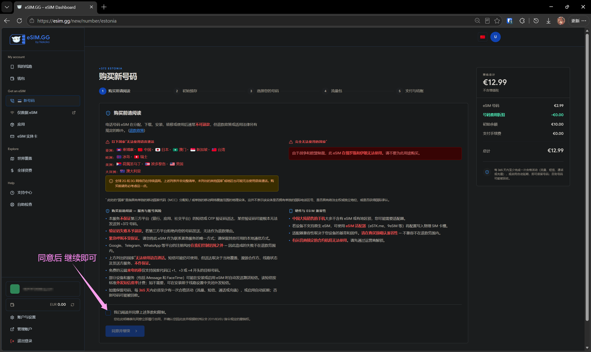

   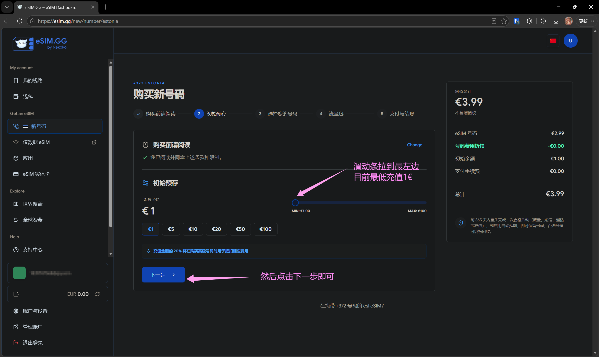

3. 选择一个爱沙尼亚（+372）号码。绿色 **€0.00** 的号码没有额外选号费；选好后继续。

   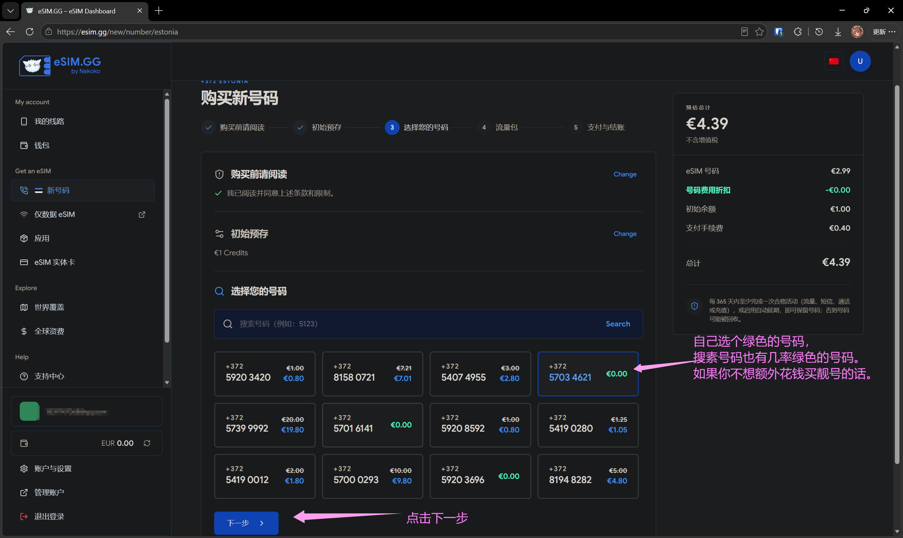

4. 流量包选“不选购流量包”，继续结账。

   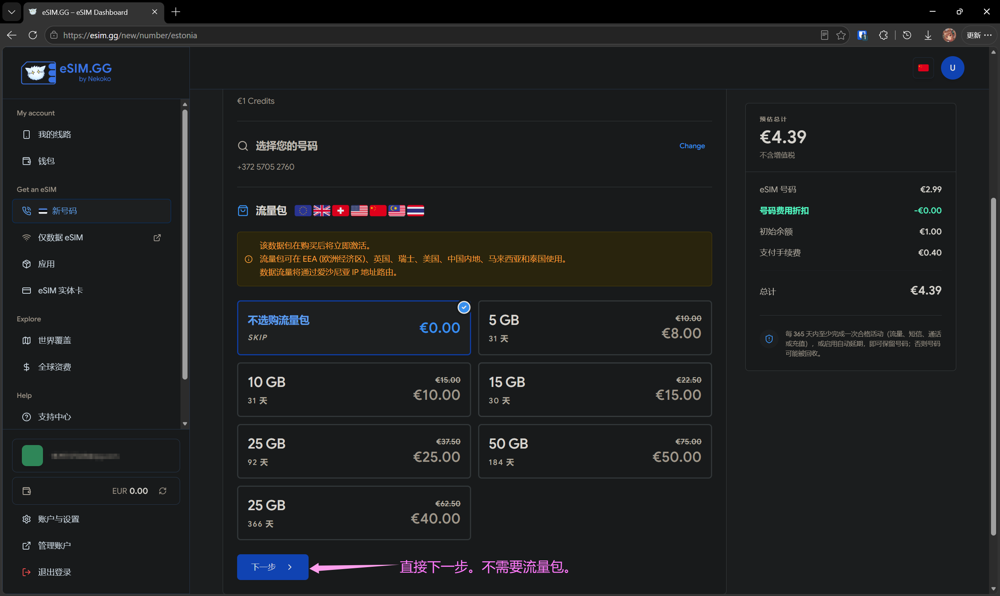

5. 选择自己方便的支付方式，输入优惠码 **`setup`**（页面仍接受时可减 €0.40），勾选确认后付款。图中选币安支付，手续费 €0.20，订单合计 **€3.79，约 ¥29**；其中 €1 是留在账户里的可用余额。支付渠道和汇率会影响最终金额，请以结账页为准。

   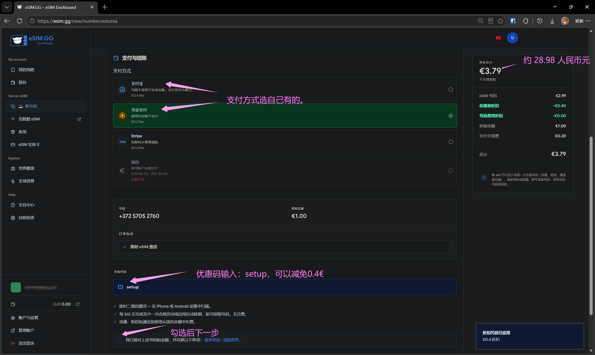

## 安装 eSIM

付款后进入“我的线路”→“安装”，用手机系统的添加 eSIM 功能扫描页面二维码即可。图中的二维码和号码已遮挡，请扫描自己账户里的二维码。

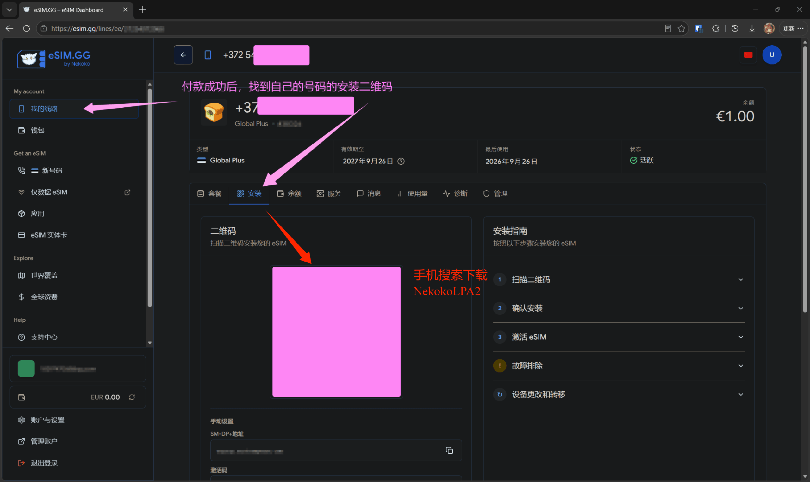

如果是没有 eSIM 功能的安卓手机，可另购兼容的 eSIM 小白卡（购买前确认手机型号和小白卡是否适配Nekoko）。  

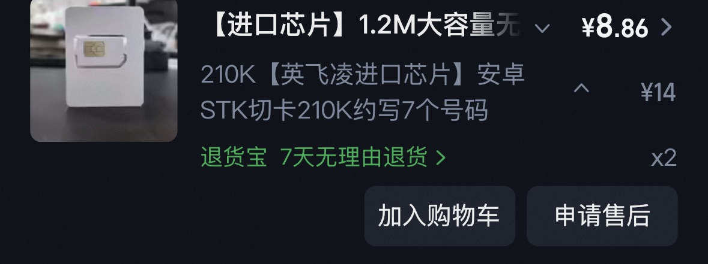
图中小白卡参考价约 **¥8.86**；几块钱的就够用了，没必要花几十块钱买牌子的；  

加上号码订单约 ¥29，合计约 **¥38**。  

将小白卡插入手机，搜索安装 [NekokoLPA2](https://lpa.nekoko.ee/)，点“+”添加配置并扫描 eSIM.gg 安装页的二维码，按提示下载配置并启用。

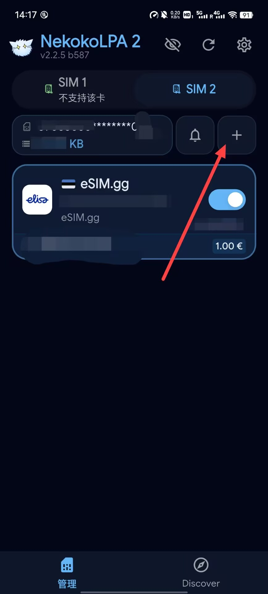

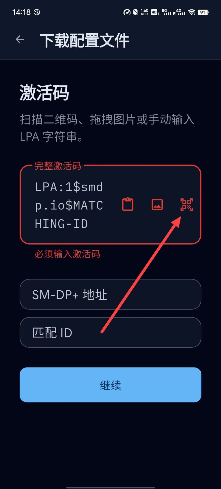

然后就可以愉快地使用了。

> 号码需每 365 天至少产生一次活动（如流量、短信、通话或充值）才能保留；部分网站的验证码短信可能无法接收，不建议用于重要账号。
